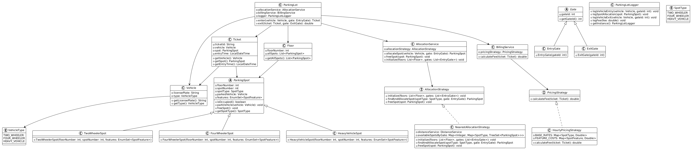

# Parking Lot Management System

A comprehensive parking lot management system implemented in Java, demonstrating object-oriented design principles and design patterns.

## Class Diagram



## Features

- **Multi-floor Support**: Supports multiple floors with different types of parking spots
- **Vehicle Type Management**: Handles Two-wheelers, Four-wheelers, and Heavy vehicles
- **EV Charging Support**: Special spots with electric vehicle charging capabilities
- **Multiple Gates**: Entry and exit gates for better traffic management
- **Smart Allocation**: Nearest allocation strategy based on distance from entry gate
- **Flexible Pricing**: Hourly pricing with feature-based additional costs
- **Comprehensive Logging**: Detailed logging of all parking operations

## Architecture

### Design Patterns Used

1. **Builder Pattern**: Used in `ParkingLot.Builder` for flexible parking lot construction
2. **Strategy Pattern**: 
   - `AllocationStrategy` with `NearestAllocationStrategy` implementation
   - `PricingStrategy` with `HourlyPricingStrategy` implementation
3. **Singleton Pattern**: `ParkingLotLogger` for centralized logging
4. **Template Method**: Abstract classes `Gate` and `ParkingSpot`

### Key Components

- **ParkingLot**: Main coordinator class managing the entire parking system
- **Vehicle**: Represents vehicles with license plates and types
- **ParkingSpot**: Abstract base for different types of parking spots
- **Gate**: Abstract base for entry and exit gates
- **Services**: AllocationService, BillingService for business logic
- **Strategies**: Pluggable algorithms for allocation and pricing

## Project Structure

```
src/main/java/com/souvik/
├── Main.java                          # Application entry point
├── ParkingLot.java                     # Main system coordinator
├── enums/
│   ├── SpotFeature.java               # Parking spot features
│   ├── SpotType.java                  # Types of parking spots
│   └── VehicleType.java               # Types of vehicles
├── logger/
│   └── ParkingLotLogger.java          # Singleton logger
├── model/
│   ├── Floor.java                     # Parking floor representation
│   ├── Ticket.java                    # Parking ticket
│   ├── gate/
│   │   ├── Gate.java                  # Abstract gate
│   │   ├── EntryGate.java            # Entry gate implementation
│   │   └── ExitGate.java             # Exit gate implementation
│   ├── spot/
│   │   ├── ParkingSpot.java          # Abstract parking spot
│   │   ├── TwoWheelerSpot.java       # Two-wheeler parking spot
│   │   ├── FourWheelerSpot.java      # Four-wheeler parking spot
│   │   └── HeavyVehicleSpot.java     # Heavy vehicle parking spot
│   └── vehicle/
│       └── Vehicle.java               # Vehicle representation
├── service/
│   ├── AllocationService.java         # Spot allocation service
│   ├── BillingService.java           # Billing and pricing service
│   └── DistanceService.java          # Distance calculation service
└── strategy/
    ├── allocation/
    │   ├── AllocationStrategy.java    # Allocation strategy interface
    │   └── NearestAllocationStrategy.java # Nearest spot allocation
    └── pricing/
        ├── PricingStrategy.java       # Pricing strategy interface
        └── HourlyPricingStrategy.java # Hourly pricing implementation
```

## Usage Example

The system supports comprehensive testing with:
- Multiple vehicle types (bikes, cars, trucks)
- Multiple entry/exit gates
- EV charging spots
- Different parking durations
- Edge case handling